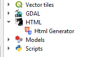
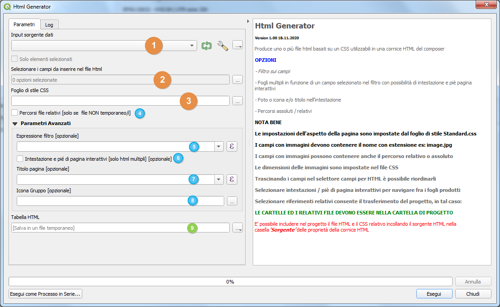

#  HTML Generator
## QGIS Plugin per processing

<!-- TOC -->

- [HTML Generator](#html-generator)
  - [QGIS Plugin per processing](#qgis-plugin-per-processing)
    - [Installazione](#installazione)
    - [Finestra processing](#finestra-processing)
    - [Opzioni](#opzioni)
    - [CSS incluso: Standard.css](#css-incluso-standardcss)
      - [Css di esempio](#css-di-esempio)
    - [Videotutorial](#videotutorial)
    - [Ringraziamenti](#ringraziamenti)

<!-- /TOC -->

### Installazione
Per installarlo basta che scarichiate lo zip del repo e da QGIS fate installa plugin da zip. 
Spero a breve sia disponibile nel repository ufficiale di QGIS.

### Finestra processing
Il plugin, una volta caricato, compare negli script di processing nella cartella HTML

Il plugin permette la composizione di una pagina HTML con i dati da una fonte tra quelle compatibili.

1. sorgente dati, eventualmente anche filtrati e/o solo selezionati;
2. selettore campi dati da inserire nell'html;
3. foglio di stile [deve stare nella cartella di progetto];
4. [opzionale] scelta tra link con persorso assoluto [default] o relativo;
5. [opzionale] espressione filtro o selezione di campo per raggruppamento;
6. [opzionale] intestazione e piè di pagina se pagine multiple;
7. [opzionale] titolo pagina [comparirà in alto a destra];
8. [opzionale] icona o immagine [comparirà in alto a destra];
9. file in uscita.

Il plugin riconosce i campi data e quelli in cui è memorizzata l'immagine o le immagini purchè con estensione di file immagine (gif; jpeg; jpg; png; svg).

I campi selezionati possono essere riordinati a piacimento.

Le dimensioni dell'icona e delle immagini possono essere espresse in tutte le unità di misura previste dall'html e impostate nel file css.

Il file css determina tutte le caratteristiche estetiche del file prodotto, riferendosi a tutti i tag html disponibili.

I file prodotti, se temporanei, avranno sempre percorsi assoluti, altrimenti non sarebbero funzionanti, se salvati possono avere sia percorsi assoluti sia relativi.

Per poter eventualmente traferire il progetto con i file html relativi, tutti i file devono risiedere in sottocartelle della cartella di progetto.

Lo script effettua una serie di controlli sulla congruenza dei percorsi dei file origine (sorgente, css, icona/immagine) e avverte se
c'è la possibilità che il file html prodotto possa non funzionare correttamente.

Per default il percorso di progetto viene considerato per primo, in seconda scelta il percorso del file sorgente.

_NOTA BENE: 
Con i file temporanei, se i campi contengono percorsi relativi, l'html prodotto non avrà le immagini correttamente visualizzate._

↑[torna su](#html-generator)↑

### Opzioni

4. link assoluti / relativi;
5. Espressione filtro: un campo tra quelli disponibili per produrre un multipagina o un filtro componibile nativo di QGIS;
6. Titolo: una qualsiasi combinazione alfanumerica nella casella di testo, senza apici, il sistema la mette in rosso, ma funziona perfettamente; altrimenti una qualsiasi composizione entro il solito calcolatore, ovviamente si tratta di una scritta non dinamica;
7. Icona o immagine: una qualsiasi immagine tra quelle compatibili:

↑[torna su](#html-generator)↑

### CSS incluso: Standard.css

Questa è la parte più interessante dato che permette una personalizzazione accurata della pagina html prodotta. Come anzidetto i tag principali utilizzati sono **'Table'**, **'b'** e **'div'**.

Per generare comodamente il css vi sono diversi tools gratuiti online tra cui **https://divtable.com/table-styler/** che permette con pochi passaggi di ottenere risultati veramente notevoli e la cui unica limitazione è la fantasia dell'autore. Il sito da anche la possibilità di definire ogni singolo aspetto dell'impaginazione.

**`Assieme al plugin è presente un CSS denominato Standard.css che trovate dentro la cartella del plugin o anche nello zip; và copiato nella cartella del vostro progetto, senza di esso la pagina prodotta sarà semplice testo incolonnato e le immagini avranno la dimensione originale.`**

E' possibile avere quanti file css si vuole e potete modificarli in base alle vostre esigenze.

Il file fornito **Standard.css** E' commentato in maniera da poter intervenire su tutti gli aspetti della pagina HTML, non vuole comunque essere esaustivo di tutte le possibilità.

E' possibile impostare come unità di misura nei parametri **width** e **height** in mm cosa che consente impaginazioni precise.

↑[torna su](#html-generator)↑

#### Css di esempio

* [Standard.css](Standard.css)

↑[torna su](#html-generator)↑

### Videotutorial

↑[torna su](#html-generator)↑

### Ringraziamenti
[QGIS.org](https://www.qgis.org/it/site/) - [divtable.com](https://divtable.com/table-styler/) - [Totò Fiandaca](https://pigrecoinfinito.com/) - A. Cusano

↑[torna su](#html-generator)↑